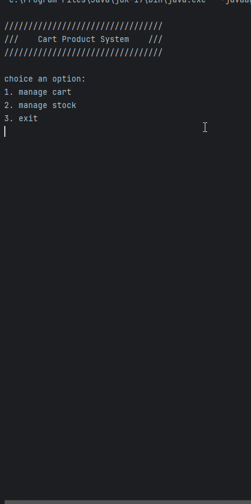

# Sistema de Carrinho de Compras Virtual

Projeto desenvolvido em Java 17 e MySQL, o mesmo conta com funcionalides como: 


## Funcionalidades

- Inserir, ver, deletar e atualizar itens no carrinho;
- Inserir, ver, deletar e atualizar itens no estoque;
- Intuitividade com o usuario.

## Demonstracao 
 <p align="center">
    


## Rodando localmente

Clone o projeto

```bash
  git clone https://github.com/jornadev/product-car-system.git
```

Entre no diretório do projeto e abra o mesmo com sua IDE de preferencia. (Recomendado o uso do Intellij)

```bash
  cd caminho/do/projeto
```

Certifique-se de ter o banco de dados MySQL configurado corretamante de acordo com o programa, como foi utilizado o JDBC para fazer a conexao será necessário adicionar o driver as "bibliotecas externas", para isso clique com o botao direito no nome do projeto e abra a secao de "Open Modules Settings", apos isso acesse a aba de "libraries", e adicione o caminho do JDBC. Voce pode encontra o driver no link abaixo. 

```bash
https://dev.mysql.com/downloads/connector/j/
```

Configure o MySQL do seguinte modo:
(usuario: root, senha: 1203, nome do banco: product_cart)
Todos esses detalhes podem ser consultados na classe src/db/DatabaseConnection.

Após criar o banco de dados voce pode rodar esse Script SQL com finalidade de criar o BD e testar as funcionalides do projeto: 

```sql
CREATE DATABASE product_cart;

USE product_cart;

CREATE TABLE product_cart (
    id INT AUTO_INCREMENT PRIMARY KEY,
    name VARCHAR(100) NOT NULL,
    category VARCHAR(255) DEFAULT 'Geral'
    price DECIMAL(10, 2) NOT NULL,
    quantity INT NOT NULL,
    total DECIMAL(10, 2) AS (quantity * price) STORED
);

CREATE TABLE stock (
    id INT AUTO_INCREMENT PRIMARY KEY,
    name VARCHAR(255) NOT NULL,
    category VARCHAR(255) DEFAULT 'Geral'
    price DECIMAL(10, 2) NOT NULL,
    quantity INT NOT NULL
);

INSERT INTO stock(name, category, price, quantity)
values("Notebook", "Eletronics", 1000, 2);
INSERT INTO stock(name, category, price, quantity)
values("Phone", "Eletronics", 600, 2);
INSERT INTO stock(name, category, price, quantity)
values("Book", "Library", 15, 2);
INSERT INTO stock(name, category, price, quantity)
values("Ukulele", "Instruments", 60, 2);
INSERT INTO stock(name, category, price, quantity)
values("Compiuter", "Eletronics", 2000, 2);
INSERT INTO stock(name, category, price, quantity)
values("TV", "Eletronics", 400, 2);
```

Após esses passos voce estará pronto para executar a classe Program e testar as funcionalides do sistema.
Para melhor experiencia aumente o tamanho do seu terminal.


